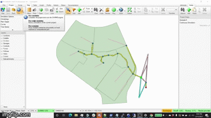

  

# PCSWMM
## Overview

- **Industry**: Hydrology and Hydraulic Modeling

- **Target OS**: Windows

- **Source Code**: PCSWMM desktop application is closed source, the associated deployment script (given here) is open sourced under the [Hypernet Community License](https://github.com/GoHypernet/CommunityLicense/blob/main/Hypernet%20Community%20License.pdf). 

- **Website**: www.pcswmm.com

## Notes

This branch contains python scripts for the integration of [Galileo](https://hypernetlabs.io/galileo/) functions into the 
PCSWMM desktop application. The scripts deploy a [SWMM5](https://github.com/GoHypernet/Galileo-Mission-Frameworks/tree/epa-swmm) 
job to a remote instance, track its progress, download the results, and refresh the currently loaded model. 

## Installation

You must be running the latest version of the PCSWMM desktop application. Place `galileo.py` and `run_form.py` in the
`%AppData%\PCSWMM\Scripts` directory. Next, unzip the env-galileo folder (which is an IronPython compatible version 
of the [Galileo SDK](https://github.com/GoHypernet/Galileo-sdk)) and place it inside the PCSWMM Lib directory 
at `C:\Program Files (x86)\PCSWMM Professional 2D (x64)\Lib\`. You will then be able to execute them from the 
PCSWMM IronPython environment. 
